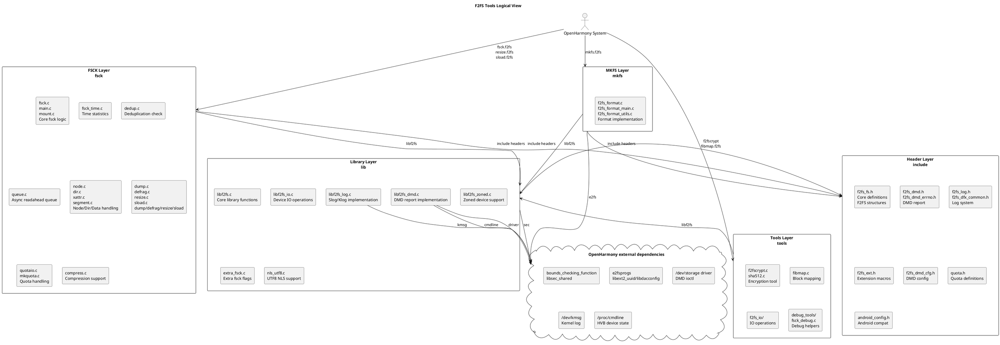

# F2FS Tools 逻辑视图

本仓整体是 OpenHarmony C/GN 工程，核心分层如下：

```text
include/
  -> lib/
    -> fsck/
    -> mkfs/
    -> tools/
```



`include/` 定义核心数据结构、DMD 上报结构、日志系统、错误码和扩展宏。扩展头文件包括 `f2fs_dmd.h`、`f2fs_log.h`、`f2fs_ext.h`、`f2fs_dmd_errno.h`。

`lib/` 是 libf2fs 共享库，提供设备 IO、zoned 设备支持、日志实现、DMD 上报实现、额外 fsck 标志检查和 UTF8 NLS 支持。扩展实现包括 `libf2fs_log.c`、`libf2fs_dmd.c`、`extra_fsck.c`。

`fsck/` 是 fsck.f2fs 核心，提供文件系统检查修复、挂载元数据构建、去重检查、时间统计、异步预读队列、quota 处理、dump、defrag、resize、sload 等能力。扩展模块包括 `fsck_time.c`、`dedup.c`、`queue.c`。

`mkfs/` 是 mkfs.f2fs 格式化工具。

`tools/` 提供辅助工具：f2fscrypt（加密）、fibmap.f2fs（块映射）、f2fs_io（IO 操作）、debug_tools（调试辅助）。扩展模块包括 `debug_tools/fsck_debug.c`。